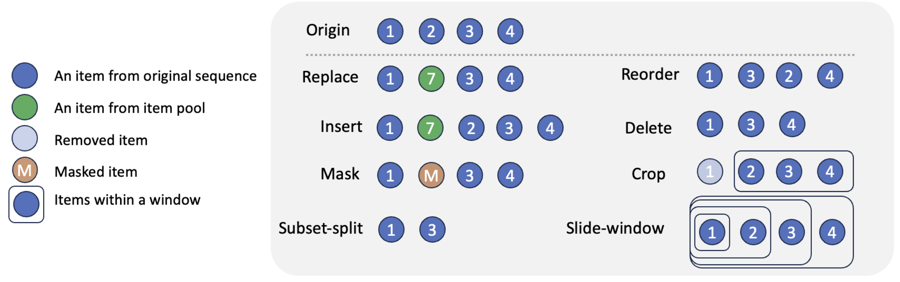

# DA4Rec

The source code for our WWW 2024 Paper [**"Is Contrastive Learning Necessary? A Study of Data Augmentation vs Contrastive Learning in Sequential Recommendation"**](https://arxiv.org/abs/2403.11136)

## Overview

Sequential recommender systems (SRS) are designed to predict users’ future behaviors based on their historical interaction data. Recent research has increasingly utilized contrastive learning (CL) to leverage unsupervised signals to alleviate the data sparsity issue in SRS. In general, CL-based SRS first augments the raw sequential interaction data by using data augmentation strategies and employs a contrastive training scheme to enforce the representations of those sequences from the same raw interaction data to be similar. Despite the growing popularity of CL, data augmentation, as a basic component of CL, has not received sufficient attention. This raises the question: Is it possible to achieve superior recommendation results solely through data augmentation? To answer this question, we benchmark eight widely used data augmentation strategies, as well as state-of-the-art CL-based SRS methods, on four real-world datasets under both warm- and cold-start settings. Intriguingly, the conclusion drawn from our study is that, certain data augmentation strategies can achieve similar or even superior performance compared with some CL-based methods, demonstrating the potential to significantly alleviate the data sparsity issue with fewer computational overhead. We hope that our study can further inspire more fundamental studies on the key functional components of complex CL techniques.



## Quick Start

1. install all the prerequisite packages required by Recbole
2. config PYTHONPATH: export PYTHONPATH=/XXX/PROJECT_ROOT
3. Prepare the dataset to '/dataset'
4. Config data augmentation settings (see demo-config.yaml)

Arguments:
   * --model: baseline model  (default: SASRec)
   * --dataset_path: path to directory of datasets (default: ../dataset)
   * --dataset: dataset name (default: Amazon_Beauty)
   * --cold_start_ratio: cold-start sampling ratio (default: 1)
   * --n_gpus: how many gpus (default: 1)
   * --n_task_per_gpu: how many tasks per gpu (default: 1)
   * --output_path: path to save results (default: None)
   * --ckpt_path: path to save checkpoints (default: None)
   * --da_config: configuration to data augmentation (default: demo-config.yaml)
   * --not_clean: whether not to delete tmp files (default: False)
   * --aug_base: base augmentation method (default: None, "recbole-slide-window" for replica)
   * --seed: random seed (default: 42)
   * --partitions: path to items list partitioned by popularity (default: None) (Note: only used for evaluation)


```python
CUDA_VISIBLE_DEVICES="0,1,2" python parallel_run.py --model=SASRec --dataset=Amazon_Beauty [--aug_base=recbole-slide-window] --n_gpus=3 --n_task_per_gpu=2 --output_path="result-outs" --ckpt_path="ckpt-outs" --da_config="demo-config.yaml"
```

## Repository Structure

```
data_augmentation
├─configs:             configurations
├─reproductivity:      configurations for reproductions
├─scripts:             scripts for reproductions
├─partitions:          item list partitioned by item popularity
├─da_operator:         operation of data augmentation
├─utils:               utilities
├─demo-config.yaml:    demo configuration file
├─da_analyzer.py:      analysis script for .xlsx export
└─parallel_run.py:     entrypoint

```

## Cite

If you find this repo useful, please cite
```
@inproceedings{Zhou2024DA,
  author       = {Peilin Zhou and
                  You{-}Liang Huang and
                  Yueqi Xie and
                  Jingqi Gao and
                  Shoujin Wang and
                  Jae Boum Kim and
                  Sunghun Kim},
  title        = {Is Contrastive Learning Necessary? {A} Study of Data Augmentation
                  vs Contrastive Learning in Sequential Recommendation},
  booktitle    = {{WWW}},
  pages        = {3854--3863},
  publisher    = {{ACM}},
  year         = {2024}
}
```

## Credit
This repo is based on [RecBole](https://github.com/RUCAIBox/RecBole).

## Contact
Feel free to contact us if there is any question. (Peilin Zhou, zhoupalin@gmail.com; You-Liang Huang, yhuang142@connect.hkust-gz.edu.cn)
